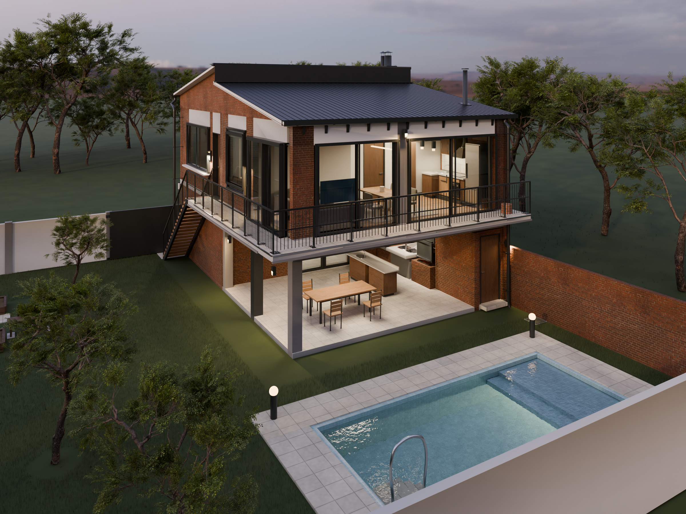

# Casa de campo · modelo y documentación arquitectónica

**[Explorar el modelo 3D](https://gatdeguin.github.io/42/)** · **[Ver las 19 imágenes](https://gatdeguin.github.io/42/renders/)** · **[Abrir los planos](https://gatdeguin.github.io/42/planos/)**

Reconstrucción editable del proyecto, basada en el HTML/JavaScript original y las correcciones del propietario. Ubicación indicada: **Virrey del Pino, La Matanza, Buenos Aires**.

**Candidato R6K en revisión. La aprobación integral de 9,5/10 y el realismo fotográfico exigidos siguen pendientes del agente crítico independiente.** La última auditoría integral publicada calificó la entrega inicial con6,9/10; las notas parciales posteriores no equivalen a aprobar esta versión. [Auditorías y evidencia](audit/).

**El video permanece pausado hasta autorización explícita.** El archivo conserva las cámaras y el recorrido editable, sin secuencia de video renderizada.

La auditoría R6K calificó dimensiones y encuentros con **9,0/10** y documentación con **9,2/10**: [dictamen parcial](audit/critica_dimensional_r6k.md). La nota integral sigue pendiente.

## Entrega del candidato

- [Blender completo R6K — descarga directa](https://media.githubusercontent.com/media/GatDeguin/42/main/output/Casa_de_Campo_95_R6K.blend), con materiales empaquetados, objetos y colecciones editables.
- [19 imágenes Cycles, ambiente por ambiente](https://gatdeguin.github.io/42/renders/), calculadas desde esta misma escena; exterior2400×1800 e interiores1800×1350.
- [33 láminas A2 en PDF](docs/planos/Casa_de_Campo_Planos_A2.pdf) y [paquete PDF +SVG +DXF](docs/planos/Casa_de_Campo_Planos_Editables.zip): plantas de toda la propiedad, cortes, fachadas, cubiertas y detalles.
- [Criterios, medidas e inferencias](docs/DECISIONES.md).
- [Uso y reproducción del visor](web-tools/README.md).

SHA256 del modelo: `a3663a5081dac391303f25b8e9994b1a412a008e971642af29fc2cbee849aa90`.

## Correcciones incorporadas

Estudio con3,20m libres y vivienda con2,60m; cubierta del estudio0,60m más alta. Barra del quincho paralela a la parrilla y comedor acercado al jardín. Cama orientada con la ventana a la derecha de quien está acostado. Nuevo acceso corredizo entre el baño y el comedor de planta alta, y mesada de cocina reordenada.

Se coordinan alturas de mobiliario, pasos, asientos y apoyos: mesa750mm, barra900mm y taburetes650mm. Los pasos se miden hasta la geometría real —incluidos tiradores— y los planos distinguen cotas del modelo de propuestas pendientes de definición.

Las13 puertas y correderas conservan mecanismos independientes. La revisión incluye barridos con41 estados, encuentros de carpinterías, soportes de18 peldaños, rodillas bajo consola, desagües representados y capas de baños. Cada prueba conserva su alcance; no demuestra por sí sola la totalidad del funcionamiento constructivo.

Pendiente geométrico documentado en A08: el volumen de agua se prolonga unos 114 mm dentro del fondo del vaso. La corrección queda para la siguiente revisión; no se presenta R6K como aprobado.

## Fuente y alcance

Lote22×20m; edificio8×12m; pileta7×3m de envolvente nominal; huerta, jardín, quincho, estudio, vivienda, baños, balcones y escalera exterior. Sin escalera interior. La hoja del portón mide3m y la luz entre pilares de fuente es2,75m.

El norte indicado por el propietario apunta abajo a la izquierda cuando Cedro Misionero queda arriba; es orientativo. Se informó disponibilidad de todos los servicios; las acometidas y el relevamiento del lote siguen pendientes.

[HTML original](source/original.html) · [Encargo](source/request.txt). Conversión métrica: HTML(X,Y,Z) → Blender(X,−Z,Y). Las instrucciones posteriores del propietario prevalecen sobre las contradicciones de la fuente. El archivo original [Casa_de_Campo_Final.blend](output/Casa_de_Campo_Final.blend) se conserva como registro y **no es el candidato R6K**.

Los detalles no definidos en la fuente se identifican como propuestas. La documentación permite revisar arquitectura y geometría; no constituye documentación ejecutiva habilitada ni cálculo estructural, hidráulico, acústico o reglamentario.

## Materiales y reproducción

Blender5.2/Cycles y visorThree.js con recursos locales. Modelos Blender mediante GitLFS: después de clonar, ejecutar `git lfs pull`.

Recursos CC0 de PolyHaven: [Belfast Sunset](https://polyhaven.com/a/belfast_sunset), [Tree Small02](https://polyhaven.com/a/tree_small_02), [Oak Veneer01](https://polyhaven.com/a/oak_veneer_01) y [Red Bricks04](https://polyhaven.com/a/red_bricks_04). Se conservan atribución, escala física y trazabilidad de los archivos; el albedo del ladrillo tiene una calibración documentada.

El visor usa geometría del modelo y materiales PBR. La navegación raster y el trazado progresivo opcional tienen límites distintos de los renders Cycles; sus verificaciones y fuentes se documentan [aquí](docs/preview95/README.md).
