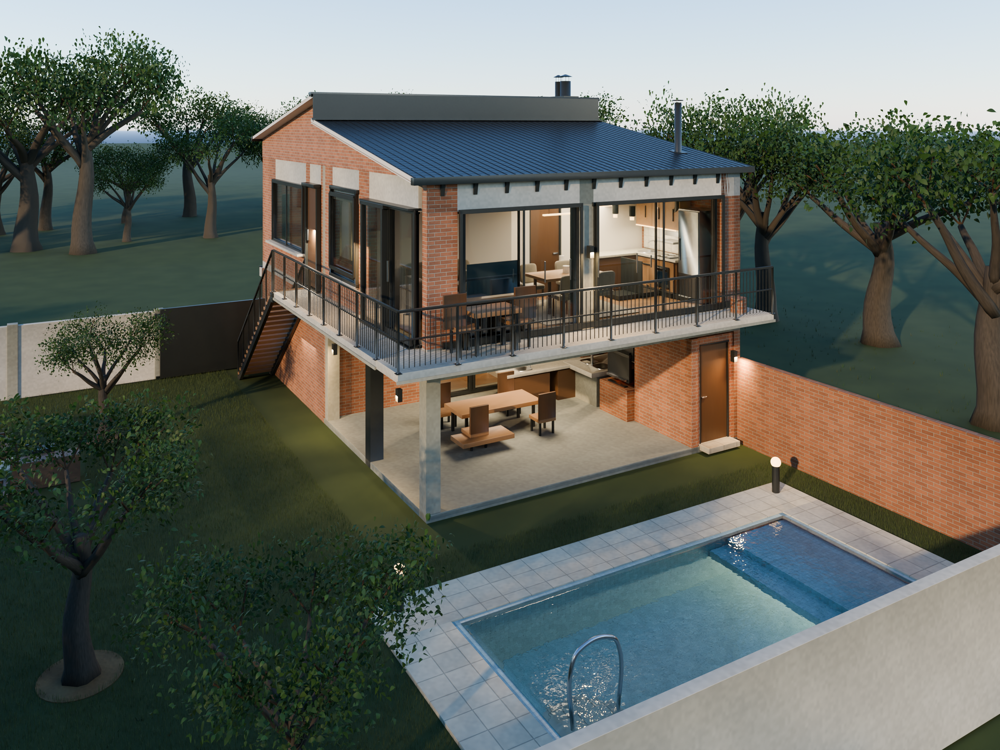

# Casa de campo · reconstrucción arquitectónica

Modelo editable en Blender 5.2, reconstruido a partir del HTML y JavaScript del proyecto. La revisión conserva implantación, dimensiones, distribución y cámaras originales, e incorpora las alturas indicadas por el propietario: **estudio 3,20 m libres y vivienda 2,60 m**, con la cubierta del estudio más alta.

**Estado:** tercera auditoría independiente aprobada con **8,0/10**, tras las evaluaciones de 6/10 y 7/10. [Dictamen final](audit/critica_iteracion_03.md). **El video permanece pausado hasta aprobación explícita del propietario.**

## Entrega vigente
- [Modelo completo: Casa_de_Campo_Final.blend](output/Casa_de_Campo_Final.blend), con materiales empaquetados, colecciones y objetos editables.
- [Render principal, 2400 × 1800](output/Casa_de_Campo_Atardecer_Revision.png).
- [Planos, cortes, detalles e imágenes interiores](review/README.md).
- [Auditorías independientes](audit/) y [respuesta a las correcciones](audit/respuesta_constructor_02.md).
- [Decisiones, dimensiones e inferencias](docs/DECISIONES.md).
- [Validación geométrica](output/validation.json).

El archivo Blender usa **Git LFS**. Para descargar la escena completa, clonar el repositorio con Git LFS y ejecutar git lfs pull. La escena vigente es Casa_de_Campo_Final.blend; el render vigente conserva el nombre Casa_de_Campo_Atardecer_Revision.png. Los archivos de las primeras iteraciones se mantienen como registro.

## Contenido
Lote 22 × 20 m; casa 8 × 12 m; pileta 7 × 3 m; quincho y línea de fuego; huerta; estudio; vivienda; baños; mobiliario; DVH; escalera exterior de 18 peldaños; balcones y paisajismo. La hoja del portón mide 3 m; la luz entre sus pilares de fuente es 2,75 m.

Las 16 cámaras del HTML se conservan. Se agregan cámaras de revisión y un recorrido editado de 1968 fotogramas a 24 fps. Las 12 puertas y correderas tienen la propiedad open: 0 cerrada, 1 abierta. Las muestras fijas del recorrido permiten revisarlo sin producir video.

## Revisión técnica
Se comprobaron las dimensiones y alturas, los barridos de todas las piezas móviles contra muros y mobiliario, los conductos frente a cerramientos y estructura, las juntas acústicas y la persistencia de la cámara al reabrir el archivo.

Las plantas, cortes y detalles derivan de la geometría del modelo. Los detalles ausentes en el HTML están documentados como desarrollo de la reconstrucción. La escena y su revisión no constituyen un cálculo estructural ni documentación ejecutiva para obra.

## Fuente y herramientas
- [HTML original](source/original.html) y [encargo](source/request.txt).
- [Scripts de extracción, construcción y verificación](scripts/). La extracción se ejecuta con node scripts/extract_scene.cjs; las verificaciones usan Blender Python.
- Conversión de ejes: HTML (X, Y, Z) → Blender (X, −Z, Y); unidades en metros.
- Mapas de materiales generados por el HTML. Entorno opcional empaquetado: [Belfast Sunset, Poly Haven](https://polyhaven.com/a/belfast_sunset), CC0.

Los scripts de render y codificación mantienen un bloqueo explícito para el video. Solo se reanudará tras la aprobación del propietario.
